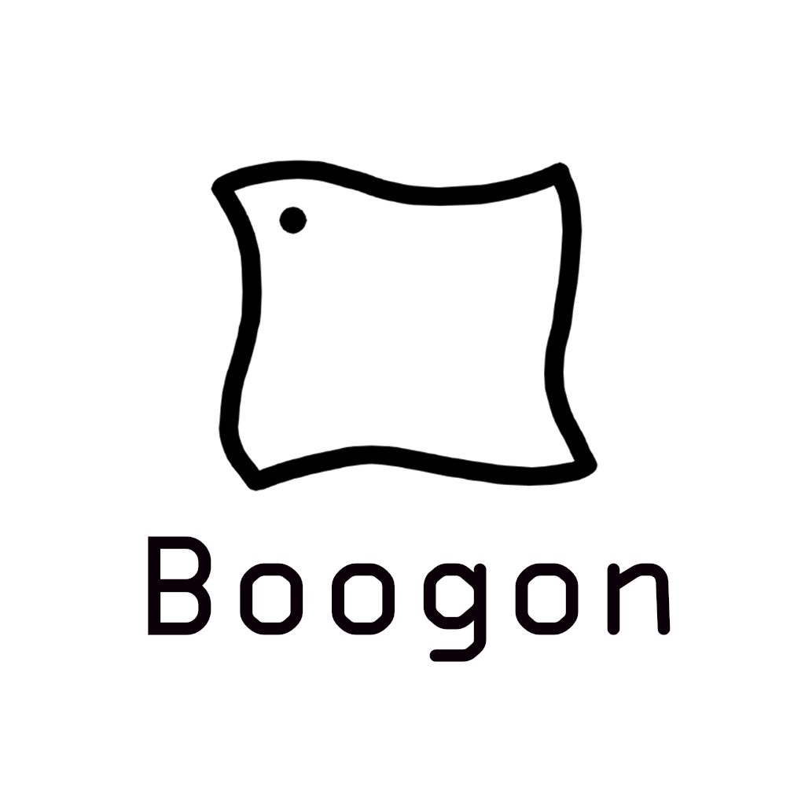

# Boogon / 布公

I am **Boogon**, a.k.a. **布公**, currently serving as an **Administrator** at **North Voice Studio** (**北声工作室**) and **Boogon Official** (**布公会客厅**), where I oversee technical development. I am passionate about exploring new probability of technology and committed to bringing value to the community through projects and creativity.

    

<h2 align="center">Technical Skills</h2>

#### Programming Languages

- **Proficient:** Python 3
- **Experienced:** C/C++, Java
- **Familiar:** HTML/CSS/JavaScript

#### Tech Stack

- **Python:** Flask
- **Node.js:** Vue.js, Vuepress, Electron

#### Tools and Platforms

- **Development Tools:** Git, Microsoft Visual Studio Code, Docker
- **Content Management:** Markdown

<h2 align="center">Organizational Roles and Contributions</h2>

#### Administrator @ North Voice Studio | 2023.6 - Present

- **Key Responsibilities:**
    + Collaborate with external partners to drive project commercialization.
    + Manage technology stack selection and implementation to ensure system stability and scalability.

- **Achievements:**
    + Providing official websites for Dongfeng Yipinmian, Anyang
    + Providing miniprogram design for Dongfeng Yipinmian, Anyang

#### Administrator @ Boogon Official | 2024.4 - Present

- **Key Respomsibilities:**
    + Overss project planning and execution to ensure timely deployment.
    + Enhance brand effect.

- **Achievement:**
    + Boogon Official Website: [www.boogon.com](https://www.boogon.com)
    + Boogon Official Docs: [docs.boogon.com](https://docs.boogon.com)

<h2 align="center">Projects</h2>

#### Boogon Official Website

_Official Website of Boogon Official._

- **Tech Stack:** Vue.js

- **Link:** [https://www.boogon.com](https://www.boogon.com)

#### Boogon Official Docs

_Document Site of Boogon Official._

- **Tech Stack:** Vue.js, Vuepress

- **Link:** [https://docs.boogon.com](https://docs.boogon.com)

#### Brollo the VTuber

_An Experiment for AI VTuber Brollo._

- Details Not Available.

<h2 align="center">Contact Information</h2>

Feel free to reach out of me for collaborations, opportunities or just to connect.

- **Email:** [administrator@boogon.com](mailto:administrator@boogon.com)
- **Github:** [BoogonClothman](https://github.com/BoogonClothman)
- **X/Twitter:** [Boogon](https://x.com/BoogonClothman)

> The high destiny of the individual
>
> Is to serve rather than to rule
>
> The only good is knowledge
>
> And the only evil is ignorance
>
> Stars can't shine
>
> Without darkness
>
> Let him who would move the world
>
> First remove himself
>
> Follow your curiously
>
> Life is about finding ****self
>
> _**+ERABY+E CONNEC+10N** かめりあ_
