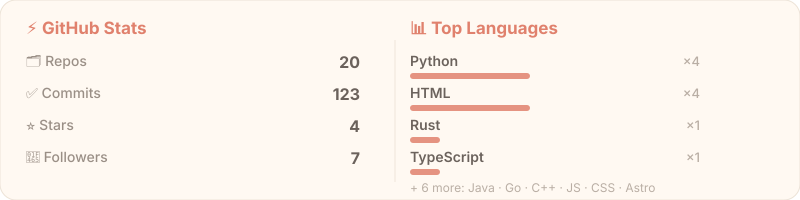

  

<h1 align="center">Hi, I'm Boogon 👋</h1>

<b>世界与我，步履生痕</b> — <i>Traces in Our Wake.</i>

  <i>A developer who cares about design and craft. 
  Building software with intention — from CLI tools to design systems.</i>

  
  
  
  
  
  
  

---

## 🧰 Toolbox

Technologies I reach for when building:

`Python` · `Rust` · `Java` · `Go` · `C++` · `TypeScript` · `JavaScript` · `Astro`  
`React` · `Next.js` · `Node.js` · `Tailwind CSS` · `PostgreSQL` · `Docker` · `GraphQL` · `Figma`

---

## 🚀 Highlights

A selection of things I've shipped — each one taught me something new.

| Project | Description | Stack |
| :--- | :--- | :--- |
| [**Lango**](https://github.com/BoogonClothman/Lango) | A fast CLI English dictionary powered by a local ECDICT database — works offline, supplements online. | Rust |
| [**claude-ui-design-skill**](https://github.com/BoogonClothman/claude-ui-design-skill) | Building a claude.ai-style UI from scratch — design systems in practice. | HTML · CSS |
| [**boogon-official**](https://github.com/BoogonClothman/boogon-official) | My official website: warm canvas, coral accents, editorial typography. | Next.js · TS · Tailwind |
| [**ChiyingNana**](https://github.com/BoogonClothman/ChiyingNana) | A character website with clean design and smooth animations. | Astro · TS |
| [**exam4agents**](https://github.com/BoogonClothman/exam4agents) | An exam system that makes AI agents understand software engineering fundamentals. | Python |
| [**ubuntu-cream**](https://github.com/BoogonClothman/ubuntu-cream) | A warm cream-toned Typora theme. | CSS |

**More:** [python-cookbook](https://github.com/BoogonClothman/python-cookbook) · [troy-agent](https://github.com/BoogonClothman/troy-agent)

---

## 🤖 AI Models

Character LoRAs for VTuber role-play, fine-tuned on Qwen3-0.6B in Chinese.

| Model | Description | Base |
| :--- | :--- | :--- |
| [sakura-qwen3-0.6b-lora-demo-v2](https://huggingface.co/Boogon/sakura-qwen3-0.6b-lora-demo-v2) | 小樱 (Sakura) VTuber role-play LoRA — v2 | Qwen3-0.6B |
| [sakura-qwen3-0.6b-lora-demo-v1](https://huggingface.co/Boogon/sakura-qwen3-0.6b-lora-demo-v1) | 小樱 (Sakura) VTuber role-play LoRA — v1 | Qwen3-0.6B |

---

## 📝 What I'm into

- **Learning through building** — 兴趣驱动的业余项目是最好的老师。
- **Design & craft** — clean typography, warm palettes, deliberate UI.
- **Languages & tools** — from Rust CLIs to Python tooling to TypeScript web apps.
- **AI & agents** — teaching agents software engineering, and controlling PCs by natural language.
- **VTubers & AI characters** — fine-tuning LoRA adapters on Qwen, Live2D frontends, and character websites.

---

## 📊 GitHub Stats

  

---

  <a href="https://www.boogon.com"><b>Website</b></a> · 
  <a href="https://twitter.com/BoogonClothman"><b>Twitter / X</b></a> · 
  <a href="https://github.com/BoogonClothman"><b>GitHub</b></a> · 
  <a href="https://huggingface.co/Boogon"><b>Hugging Face</b></a>

  <i>世界与我，步履生痕 · Building things and writing about the process.</i>

