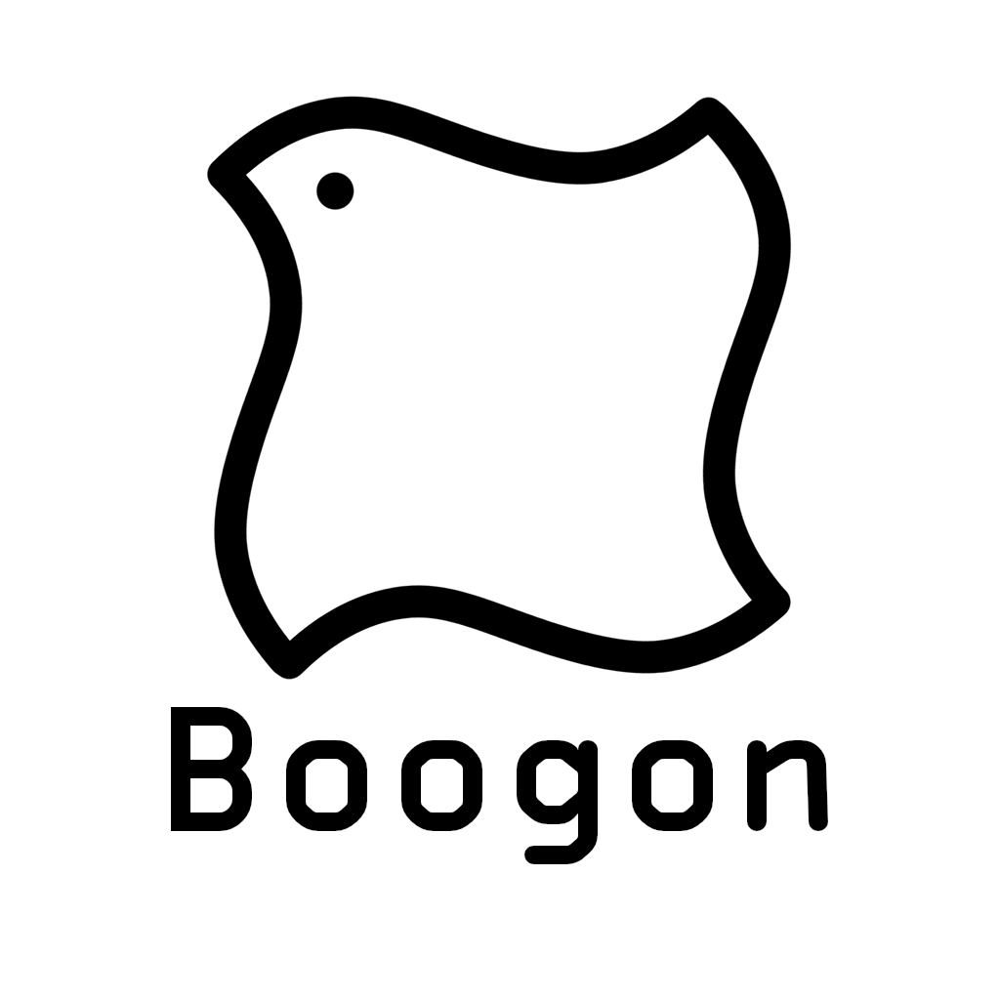

[English](./README.md) / 简体中文

<h1 align="center">布公 / Boogon</h1>

这里是**布公**, 也称**Boogon**, 目前担任**北声工作室**（**North Voice Studio**）和**布公会客厅**（**Boogon Reception Room**）的**总负责人**，主管技术开发部分。热衷于探寻技术的新可能性，致力于通过项目和创造力为社会带来价值。

    

<h2 align="center">技术技能</h2>

#### 高级编程语言

- **精通** Python 3
- **掌握** C/C++, Java
- **熟悉** HTML/CSS/JavaScript

#### 技术栈

- **Python:** Flask
- **Node.js:** Vue.js, Vuepress, Electron

#### 工具和平台

- **开发工具：** Git, Microsoft Visual Studio Code, Docker
- **内容管理：** Markdown

<h2 align="center">组织角色和贡献</h2>

#### 北声工作室管理员 | 2023.6 至今

- **主要职责：**
    + 与外部合作伙伴合作，推动项目商业化。
    + 管理技术栈选择和实施，以确保系统稳定性和可扩展性。

- **成就：**
    + 为安阳东风壹品棉提供官网建设。
    + 为安阳东风壹品棉提供微信小程序设计。

#### 布公会客厅总负责人 | 2024.4 至今

- **主要职责：**
    + 监督项目规划和执行，确保及时部署。
    + 增强品牌效应。

- **成就:**
    + 布公会客厅官网 [www.boogon.com](https://www.boogon.com)
    + 布公会客厅文档站 [docs.boogon.com](https://docs.boogon.com)

<h2 align="center">项目</h2>

#### 布公会客厅官网

_布公会客厅官方网站_

- **技术栈：** Vue.js

- **链接：** [https://www.boogon.com](https://www.boogon.com)

#### 布公会客厅文档站

_布公会客厅文档站_

- **技术栈：** Vue.js, Vuepress

- **链接：** [https://docs.boogon.com](https://docs.boogon.com)

#### 虚拟主播布洛洛

_人工智能虚拟主播布洛洛实验项目，以及一个基于API运行AI虚拟主播的框架。_

- 细节暂不透露。

<h2 align="center">联系方式</h2>

欢迎联系我进行合作、寻求机会或只是建立联系。

- **电子邮件：** [administrator@boogon.com](mailto:administrator@boogon.com)
- **Github：** [BoogonClothman](https://github.com/BoogonClothman)
- **X/Twitter：** [BoogonClothman](https://x.com/BoogonClothman)

